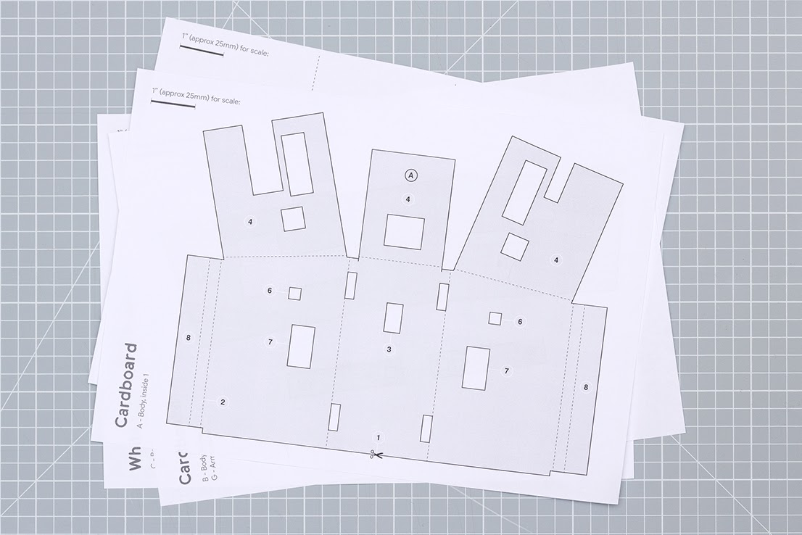

# one hash
## two hash
### three hash
#### four hash
##### five hash
###### six hash

unicode:

some unicode &#9658; here

some unicode &#2192 here

some unicode &#2192; here

warning &#9888; warning
:warning:

---

some text<br>
<br>
<br>

line break

Link images like this:





- bullet point?
```
code?
```
---

text

:fire:

:tada:


